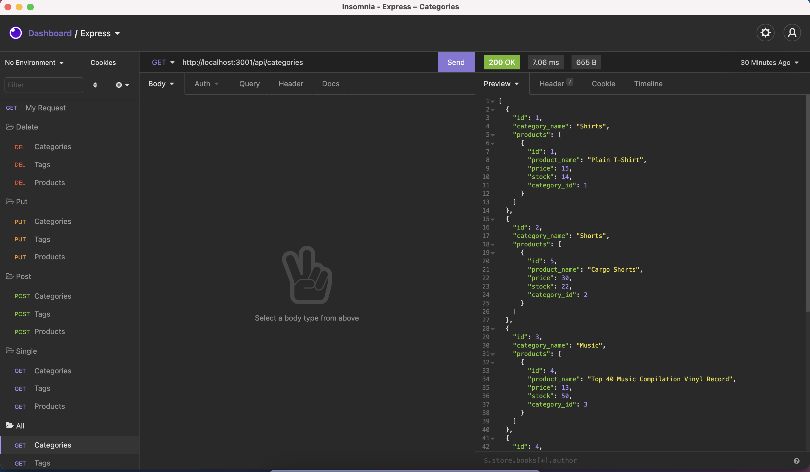

# E-Commerce-Back-End

## Description
This app is practice to building the back end for an e-commerce site by modifying starter code. I configured a working Express.js API to use Sequelize to interact with a MySQL database. I was able to practice ORM creating models, RESTful routes, and using Insomnia to manipulate the data.

## Table of Contents
- [Installation](#installation)
- [Usage](#usage)
- [Credits](#credits)
- [License](#license)
- [Tests](#tests)
- [Qustions](#questions)

## Installation
The user must install NPM packages dotenv, express, mysql2, sequelize. They must also have MYSQL and a backend API client such as Insomnia to test the routes and CRUD functionality.

## Usage
The user must add the database and seed it in MYSQL. Once the database is seeded, run node server.js in the CLI. The user must then use an API testing tool to interact with the backend functionality and the database.

**Video walkthrough of the app: [DEMO](https://watch.screencastify.com/v/idJjkbLGIIuzsHnRsLGn) || [Backup DEMO](https://drive.google.com/file/d/1NE6Fm53_F06jIdrW0L_zUakm2JNxZi73/view)**

## Credits
Collaborators that helped with this project: Tutor: Jacob

## License
This project is covered under an MIT license. More information can be found here: https://opensource.org/licenses/MIT

## Tests
n/a

## Questions
If you have any questions, feel free to email <mrronsit@gmail.com> or feel free to peruse my [Github](https://github.com/sitmeister)!
